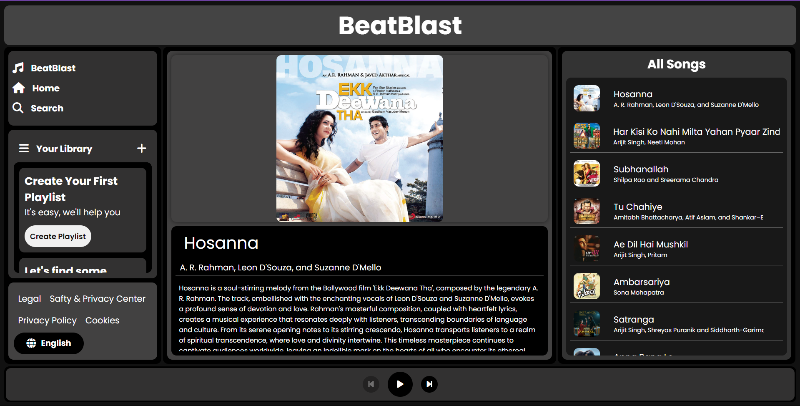
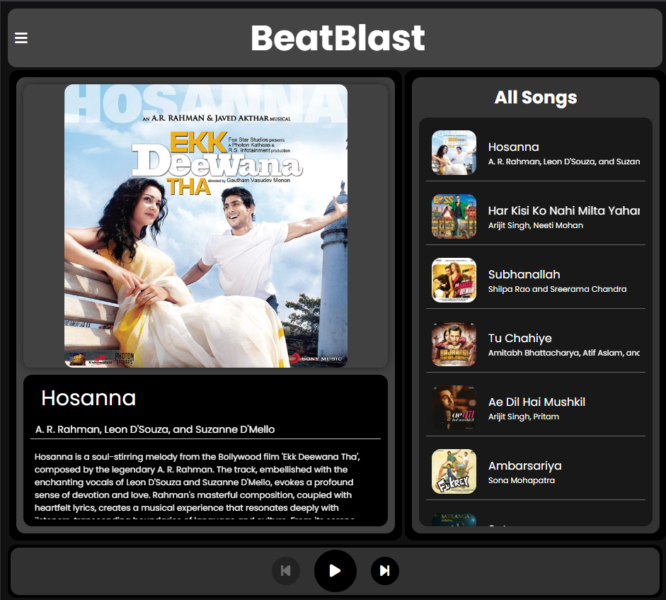
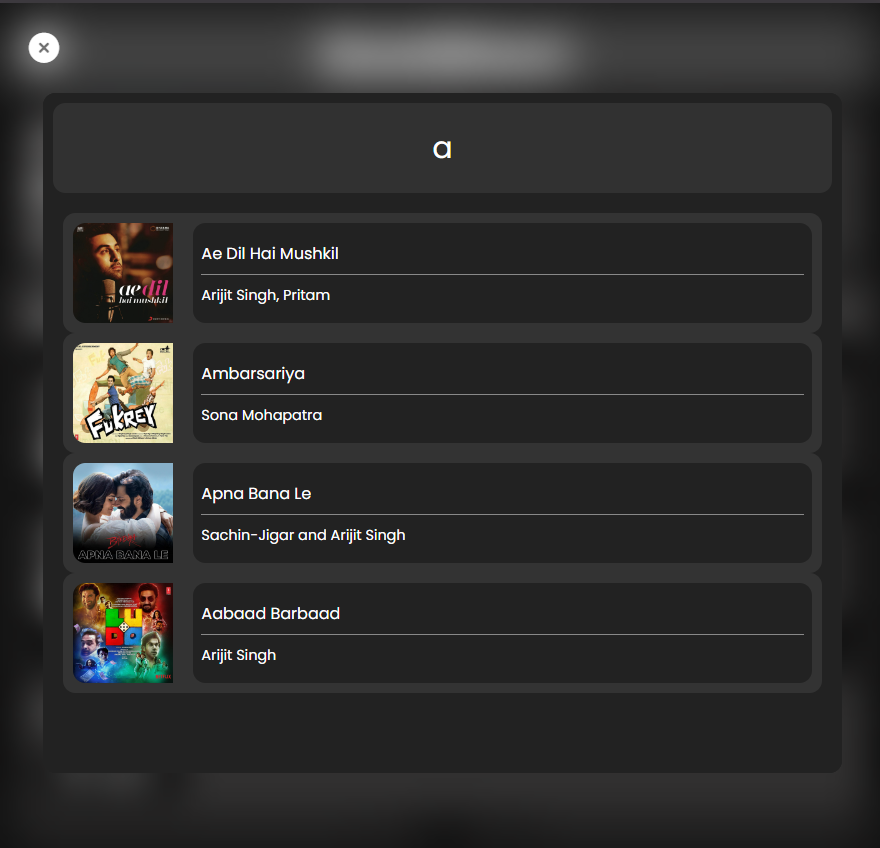
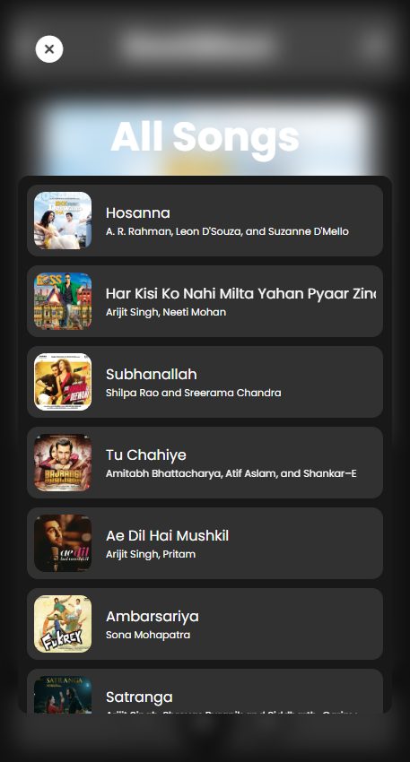

# 🎵 Music Player Application - BeatBlast

BeatBlast is a sleek and responsive music player crafted with HTML, CSS, and JavaScript. It lets users explore, search, and enjoy their favorite tracks with ease, offering a smooth and engaging listening experience.

## 🔥 About

**BeatBlast**: Your go-to music hub for discovering, creating, and enjoying beats with style.

## 🌐 Live Demo

Check out the live app here: [https://beat-blast-by-prady.vercel.app/](https://beat-blast-by-prady.vercel.app/)

## ✨ Features

- ▶️ Play, pause, skip to next or previous song.
- 📝 Song details: name, artist, album, and description.
- 🔍 Search songs by name.
- 📱 Fully responsive for desktop, tablet, and mobile devices.

## 🚀 Usage

1. Open the application: [BeatBlast by Prady](https://beat-blast-by-prady.vercel.app/)
2. Click **Play** to start the music.
3. Use **Next/Back** to navigate through tracks.
4. Use **Search** to find songs by name.
5. Sit back and enjoy the beats!

## 🛠️ Technologies Used

- **HTML5** – Page structure  
- **CSS3** – Visual design & responsiveness  
- **JavaScript** – Functionality & interactivity  
- **Vercel** – Hosting and live deployment

## 🤝 Contributing

Pull requests are welcome! If you spot a bug or have feature suggestions, feel free to contribute. Let’s build something amazing together. 🌟

## 🙏 Credits

- Huge thanks to all the music creators and vocalists whose content is used in this app for demonstration purposes only.

## 🖼️ Screenshots

| Desktop | Tablet | Mobile |
|--------|--------|--------|
|  |  |  |

| Menu (Mobile/Tablet) | Search Section | Music Section |
|----------------------|----------------|----------------|
|  |  |  |

---

